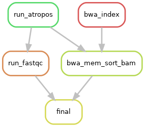
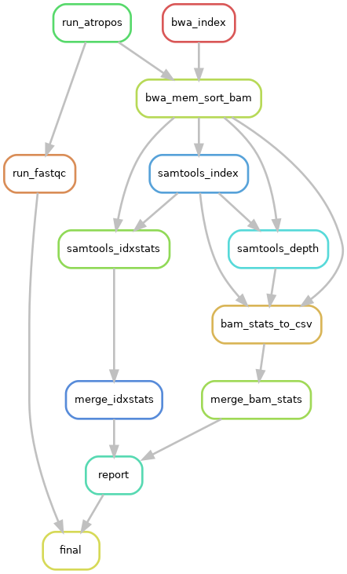
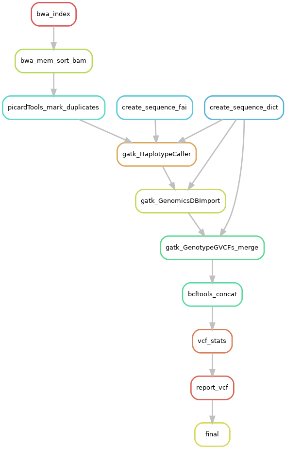
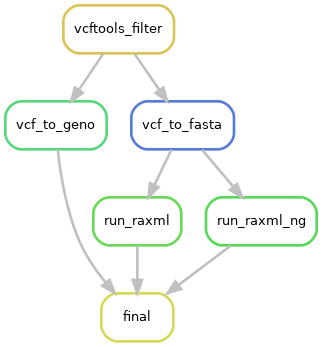

How used the best SNP calling workflow for GBS or full genome sequencing !!!!

.. contents:: Table of Contents
   :depth: 2
   :backlinks: entry

From fastq to bam
-----------------

RattleSNP is a really flexible tool mapped paired data. You can give parameters on the *config.yaml* file to RattleSNP to generate a modular, dedicated pipeline for your own data.

Mapping
.......

RattleSNP includes (at the moment) only BWA tools.

Included tools :

* BWA_MEM http://bio-bwa.sourceforge.net/bwa.shtml
* BWA_SAMPE  http://bio-bwa.sourceforge.net/bwa.shtml

Optional statistics
........................

Using RattleSNP you can activate or deactivate statistics on mapping steps.

Directed acyclic graphs (DAGs) show the differences between deactivated (BUILD_STATS=False):

and activated BUILD_STATS step on configuration file (BUILD_STATS=True):

.. warning::
    In any case, MAPPING will be activated if BUILD_STATS is True even if MAPPING-ACTIVATE is False

SNP calling
-----------

The SNP calling is perform by GATK tools.

Included tools :

* GATK version >= 4.0.0 https://gatk.broadinstitute.org/hc/en-us/articles/360036194592-Getting-started-with-GATK4

Filter VCF and genetics tools
-----------------------------

